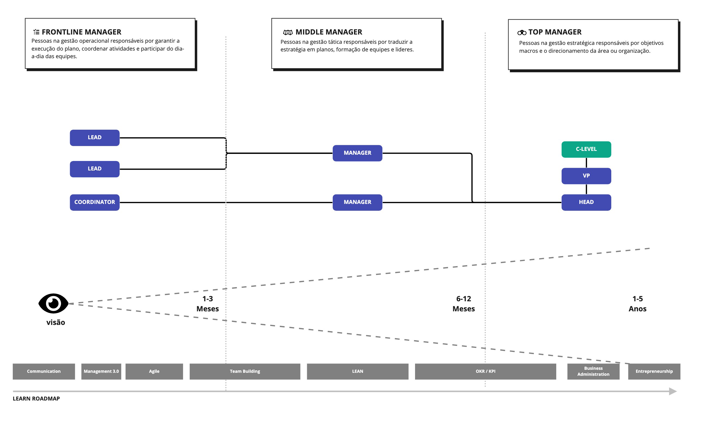

# Níveis de Gestão

## Gestão como Trilha de Carreira Distinta

A gestão representa uma **trilha de carreira própria** nos modelos Y e W de topologia. Assim como contribuidores individuais (ICs) progridem em níveis de expertise técnica, gestores progridem em níveis de liderança organizacional.

### Por que Níveis Claros de Gestão Importam?

Níveis bem definidos de gestão:

- **Clareza de progressão**: Gestores entendem seu caminho de crescimento
- **Expectativas alinhadas**: Organização e gestor sabem o que esperar em cada nível
- **Desenvolvimento estruturado**: Cada nível tem competências e responsabilidades específicas
- **Comparabilidade com IC**: Níveis equivalentes entre trilhas IC e Gestão

### Como Níveis de Gestão se Relacionam com ICs?

Em frameworks maduros, **gestão e IC são trilhas equivalentes**:

| Nível IC | Nível de Gestão | Escopo de Impacto |
|----------|-----------------|-------------------|
| Senior IC (5-6) | First-Line Manager | Time/Equipe |
| Staff/Principal (7-8) | Middle Manager | Departamento |
| Distinguished/Fellow (9-10) | Senior Leader | Organização |

### Progressão

A jornada típica na gestão:

1. **Contribuidor Individual**: Foco em entregas pessoais
2. **First-Line Manager**: Impacto através de uma equipe
3. **Middle Manager**: Impacto através de múltiplos times
4. **Top Manager**: Impacto através da organização inteira

---

## As Três Camadas de Gestão

Muitos acreditam que gestão é tudo igual, mas a realidade é bem diferente. Dentro de uma organização, cada camada de gestão tem **escopo, responsabilidades e competências distintas**:

1. **First-Line Manager**: Lidera contribuidores individuais
2. **Middle Manager**: Lidera gestores e iniciativas complexas
3. **Senior Leader**: Define estratégia e lidera departamentos/divisões

---

## First-Line Manager

### Títulos Alternativos
Engineering Manager, Team Lead, Manager, Coordenador

### Escopo Típico

- **Gerencia**: 4-8 contribuidores individuais
- **Abrangência**: Um time ou pequeno conjunto de projetos relacionados
- **Foco**: Operacional (execução)
- **Horizonte de planejamento**: 1-3 meses (curto prazo)

### Responsabilidades-Chave

**Gestão de Pessoas**:
- Conduzir 1-on-1s e conversas de carreira
- Gestão de performance e feedback contínuo
- Contratação e onboarding de novos membros
- Desligamentos quando necessário
- Cuidar da saúde e moral do time

**Gestão de Trabalho**:
- Atribuição e priorização de tarefas
- Remover bloqueadores para o time
- Acompanhar entregas e resultados
- Definir prioridades de curto prazo

**Representação**:
- Representar o time para stakeholders
- Apoiar comunicação interna
- Traduzir estratégia em ações operacionais

### Competências Centrais

**Coaching e mentoria**: Desenvolver ICs individualmente  
**Comunicação (em todas direções)**: Para cima, para baixo, lateral  
**Planejamento tático**: Quarterly/mensal  
**Resolução de conflitos**: Mediar tensões no time  
**Entendimento técnico**: Manter credibilidade com ICs (não precisa codificar, mas entender)

### Transição Típica
**De**: Senior IC (Nível 5-6)  
**Quando**: Profissional demonstra interesse em liderança e habilidades interpessoais

### Impacto
**Nível de time**: Output e crescimento de um único time

### Autonomia
**Independente com supervisão**: Toma decisões do time, mas tem manager que supervisiona

### Conhecimentos Recomendados

- Comunicação eficaz
- Management 3.0
- Metodologias Ágeis
- Team building
- Modelo de Tuckman (formação de times)
- Feedback e conversas difíceis

---

## Middle Manager

### Títulos Alternativos
Senior Engineering Manager, Director (em algumas orgs), Gerente de Gerentes

### Escopo Típico

- **Gerencia**: 3-6 First-Line Managers
- **Abrangência**: 20-40+ contribuidores indiretos, múltiplos times
- **Foco**: Tático (alinhamento entre execução e estratégia)
- **Horizonte de planejamento**: 6-12 meses (médio prazo)

### Responsabilidades-Chave

**Desenvolvimento de Gestores**:
- Coaching de First-Line Managers
- Desenvolver habilidades de gestão na equipe
- Calibração de performance entre times

**Planejamento Estratégico-Tático**:
- Definir OKRs departamentais
- Roadmaps de médio prazo
- Alocação de recursos entre times
- Gestão de orçamento

**Alinhamento Organizacional**:
- Sincronizar múltiplos times para objetivos comuns
- Representar departamento em fóruns cross-funcionais
- Resolver dependências entre times

**Processos e Sistemas**:
- Desenhar e otimizar processos
- Padronizar práticas entre times
- Escalabilidade organizacional

### Competências Centrais

**Desenvolvimento de managers**: Coaching de líderes  
**Pensamento estratégico**: Conectar execução à estratégia  
**Influência lateral**: Trabalhar com outros departamentos  
**Delegação e confiança**: Evitar microgerenciamento  
**Gestão de recursos**: Pessoas, budget, prioridades

### Transição Típica
**De**: First-Line Manager com 2-4 anos de experiência  
**Quando**: Demonstra capacidade de desenvolver outros líderes e pensar estrategicamente

### Impacto
**Nível de departamento**: Output de múltiplos times, função inteira (ex: toda a engenharia)

### Autonomia
**Liderança**: Define estratégia departamental com alinhamento executivo

### Conhecimentos Recomendados

- Comunicação estratégica
- Management 3.0
- Staff Engineer (entender nível técnico estratégico)
- Product Management (colaboração com produto)
- Arquitetura de sistemas e organizacional
- Modelagem e otimização de processos
- Coaching e mentoria avançada
- Agile at Scale (SAFe, LeSS, etc.)
- OKR e KPIs
- Roadmapping
- Lean principles

---

## Top Leader

### Títulos Alternativos
VP of Engineering, Senior Director, Head of Engineering, CTO (em algumas orgs)

### Escopo Típico

- **Gerencia**: Múltiplos Middle Managers ou departamentos inteiros
- **Abrangência**: 50-200+ contribuidores indiretos, cross-functional
- **Foco**: Estratégico (visão, cultura, objetivos de longo prazo)
- **Horizonte de planejamento**: 1-5 anos (longo prazo)

### Responsabilidades-Chave

**Visão e Estratégia**:
- Definir visão de longo prazo para engenharia
- Alinhar roadmap técnico com estratégia de negócio
- Tomar decisões de "build vs buy", arquitetura macro

**Cultura e Organização**:
- Moldar cultura de engenharia
- Desenho organizacional (estrutura de times)
- Employer branding e recrutamento estratégico

**Gestão Executiva**:
- Gestão de budget significativo
- Reportar para C-level ou board
- Representar engenharia em decisões executivas

**Desenvolvimento de Liderança**:
- Coaching de Middle Managers e Senior ICs
- Succession planning
- Construir pipeline de liderança

### Competências Centrais

**Liderança visionária**: Inspirar e alinhar organização  
**Planejamento estratégico**: Pensar 2-5 anos à frente  
**Influência executiva**: Trabalhar com C-suite e board  
**Gestão de mudança**: Transformações organizacionais  
**Business acumen**: Entender negócio, não só tecnologia

### Transição Típica
**De**: Middle Manager com 3-5+ anos de experiência  
**Quando**: Demonstra visão estratégica, influência executiva e capacidade de liderar transformações

### Impacto
**Nível organizacional**: Impacto em toda a engenharia ou empresa

### Autonomia
**Definindo direção**: Define visão e estratégia, com accountability para board/CEO

### Conhecimentos Recomendados

- Comunicação executiva
- Blitzscaling
- Company Bets e North Star
- Lean principles
- OKR e KPIs estratégicos
- Roadmap de produto e tecnologia
- Management 3.0
- Gestão de mudança organizacional
- Finanças para líderes
- Arquitetura organizacional

---

## Avançando pelos Níveis de Gestão

### Critérios de Progressão

A progressão entre níveis de gestão não é automática e requer demonstração consistente de:

**De IC para First-Line Manager**:
- Influência técnica sólida no nível Senior ou acima
- Mentoria informal de outros ICs
- Interesse genuíno em desenvolvimento de pessoas
- Habilidades de comunicação e empatia
- Disposição para trocar trabalho técnico profundo por impacto através de outros

**De First-Line para Middle Manager**:
- 2-4 anos de experiência como gestor
- Capacidade comprovada de desenvolver ICs que crescem na carreira
- Pensamento estratégico além do próprio time
- Influência em outros times e áreas
- Gestão eficaz de conflitos e crises

**De Middle Manager para Senior Leader**:
- 3-5+ anos como Middle Manager
- Visão estratégica demonstrada em iniciativas multi-ano
- Influência executiva e credibilidade com C-level
- Histórico de transformações organizacionais bem-sucedidas
- Capacidade de desenvolver outros líderes (não só ICs)

### Sinais de Que Você Está Pronto

**Você está "fazendo o trabalho antes do título"**: Já assume responsabilidades do próximo nível informalmente  
**Peer recognition**: Outros líderes no nível-alvo te veem como igual  
**Scope creep positivo**: Você naturalmente expande seu escopo de impacto  
**Manager's endorsement**: Seu gestor ativamente te patrocina para promoção

---

## Gestão Através das Topologias

### Modelo Y

**First-Line Manager**: Comum em ambas as tracks (IC e Manager)  
**Middle Manager**: Geralmente presente apenas na track de Manager  
**Senior Leader**: VP/Directors no topo da organização

No Modelo Y, a transição IC → Manager é **permanente** (sem volta fácil). Isso torna a decisão mais pesada.

### Modelo W

**First-Line Manager**: Mesma estrutura que Y  
**Middle Manager**: Equivalente a Principal/Distinguished IC em scope  
**Senior Leader**: Equivale a Staff+ IC em influência organizacional

No Modelo W, há **pontes bidirecionais** entre tracks. Um Middle Manager pode voltar para Principal IC sem perda de status.

### Modelo Network

**Leadership roles são temporários**: Alguém pode ser Tech Lead de um projeto e depois voltar a IC puro  
**Gestão de pessoas pode ser distribuída**: Múltiplas pessoas podem fazer 1-on-1s com um mesmo IC  
**Foco em competências, não hierarquia**: "Quem tem a competência lidera aquela iniciativa"

No Modelo Network, papéis de gestão são **contextuais e rotativos**.

---

## Gestão vs. IC: Diferenças-Chave

| Aspecto | Individual Contributor (IC) | Management Track |
|---------|----------------------------|------------------|
| **Fonte de impacto** | Trabalho técnico próprio | Trabalho através de outros |
| **Profundidade técnica** | Mantém hands-on até níveis seniores | Gradualmente se afasta do hands-on |
| **Tipo de trabalho** | Projetos, código, arquitetura | Pessoas, processos, estratégia |
| **Medida de sucesso** | Qualidade e impacto de entregas | Crescimento e output do time |
| **Autonomia** | Alta em decisões técnicas | Alta em decisões de pessoas/org |
| **1-on-1s** | Recebe de manager | Conduz com reports |
| **Hiring** | Participa como entrevistador | Responsável por decisão final |
| **Avaliação de performance** | Recebe feedback | Fornece feedback e calibra |
| **Progressão de carreira** | Junior → Pleno →  Senior → Staff → Principal | First-Line → Middle → Senior Leader |
| **Hard skills críticos** | Programação, arquitetura, design | Coaching, comunicação, estratégia |
| **Teto de impacto** | Bounded by escopo técnico | Bounded by tamanho da org |

---

## Próximos Passos

Agora que você entende os níveis de gestão, explore:

- **[Shapes](./03-shapes.md)**: Como I-shaped, T-shaped e Pi-shaped se aplicam a gestores?
- **[Topologias](./02-topologias.md)**: Como sua org estrutura as tracks IC e Manager?
- **[Framework de Níveis](./04-framework.md)**: Como os níveis se integram ao resto do framework?

---

## Recursos Adicionais

- [The Manager's Path](https://www.oreilly.com/library/view/the-managers-path/9781491973882/) - Camille Fournier
- [High Output Management](https://www.amazon.com.br/High-Output-Management-Andrew-Grove/dp/0679762884) - Andy Grove  
- [An Elegant Puzzle: Systems of Engineering Management](https://press.stripe.com/an-elegant-puzzle) - Will Larson  
- [Resilient Management](https://resilient-management.com/) - Lara Hogan  
- [The First 90 Days](https://hbr.org/books/watkins) - Michael Watkins
