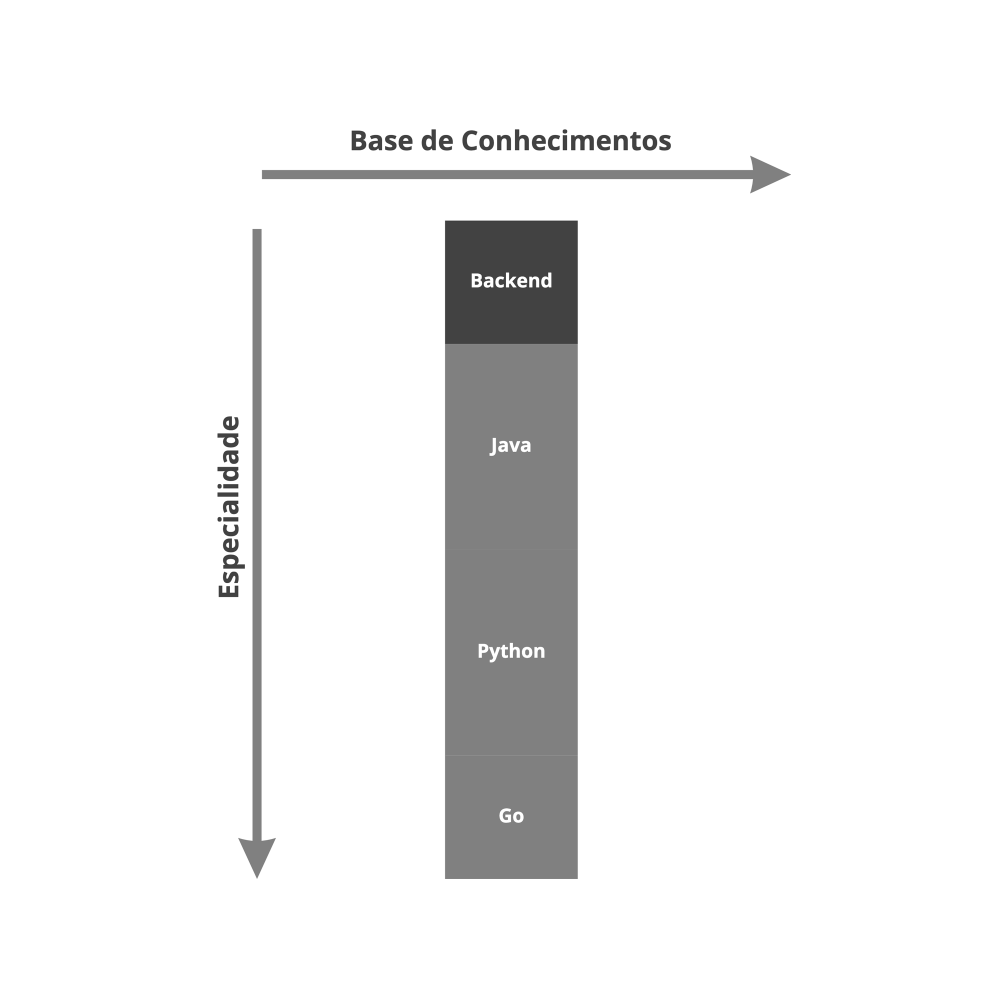
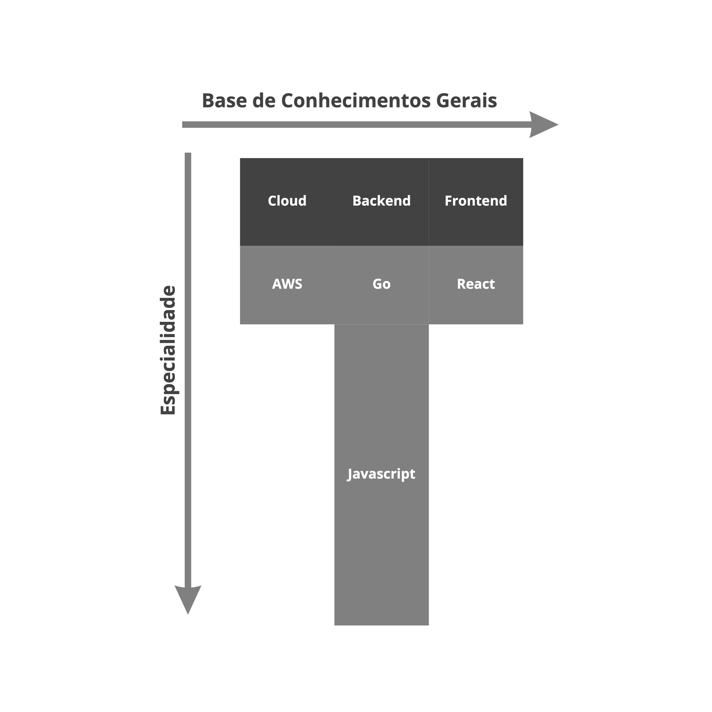
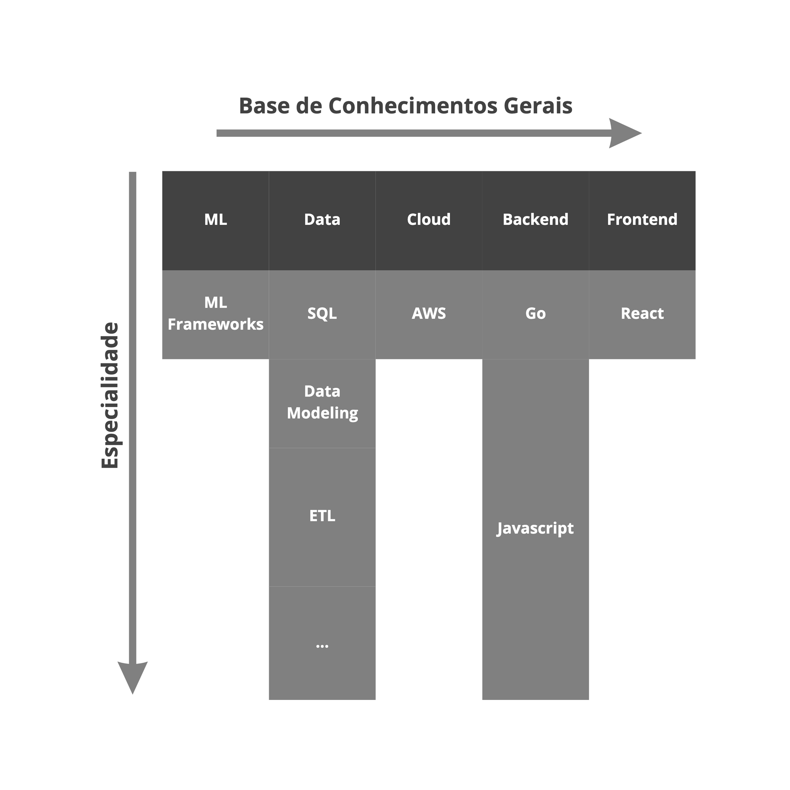

# Perfil Profissional

Perfil profissional na definição de ```shapes``` podemos dizer que é como a empresa e as pessoas observam suas habilidades, que refletem em suas atuações e responsabilidades dentro do time.

Dentro do nosso contexto vamos nos limitar a 3 tipos e com alguns ajustes de definição ao decorrer da evolucão do framework.

Atenção: Não há modelo único ideal, cada empresa e área deve adotar o que melhor performa para seus desafios. Nos exemplos deixei algumas recomenções (não regras).

Um perfil profissional não pode ser forçado em uma pessoa, já que cada pessoa tem seus próprios interesses. A empresa deve deixar claro qual a expectativa para cada função dentro do time e cabe a cada um aceitar ou não.

## I-Shaped



Profissionais que dominam uma única disciplina. Geralmente não navegam em atividades fora de seu escopo. Exemplos: Backend Engineer, .NET Developer, Frontend Engineer, UX Designer, UI Designer.

Recomendação: Pessoas especialistas em um única disciplina funcionam melhor em contextos mais específicos, para times de produto/fluxo de valor não escala muito bem, pela quantidade de pessoas que serão necessárias para uma entrega de ponta-a-ponta.

## T-Shaped



Profissionais que dominam uma disciplina e tem uma base em outras. Consegue navegar em atividades diferentes com apoio e estudo. Exemplos: Software Engineer, Staff Engineer, Product Designer, Designer.

Recomendação: Para modelos mais ágeis e enxutos pessoas com perfil em T são mais indicadas, pela flexibilidade e por conseguir colaborar com atividades diferentes.

## Comp/Pi-Shaped



Profissionais que tem uma base de conhecimento e dominam mais de um campo de conhecimento e são autossuficientes. Exemplos: Distinguished Engineer, Principal Designer.

Recomendação: Pessoas com perfil em Pi ou Comp são raras, podem ser alocadas em contextos maiores ou mais complexos para apoiar mais de um time.

## Futuro

Pessoas podem trocar de shape ao decorrer da sua carreira, na próxima versão vou me aprofundar em como essa evolução pode ser possível.
