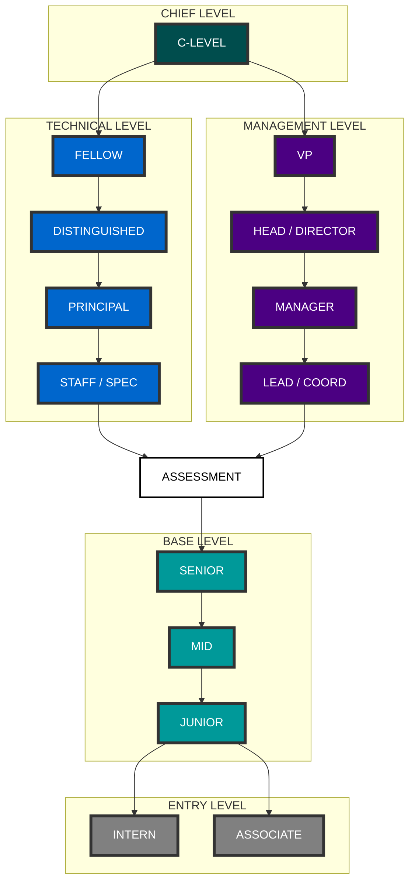
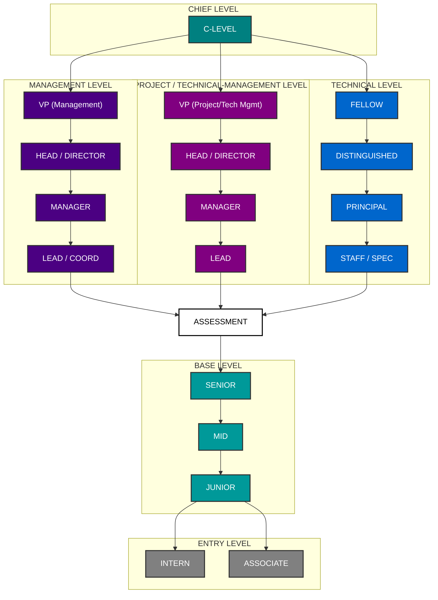
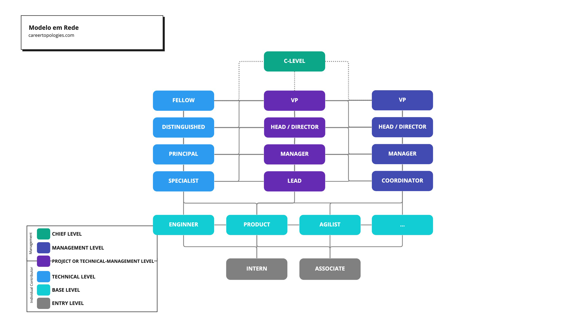

# Topologias

No contexto deste framework, o termo "topologia" é usado para descrever a forma como as carreiras são estruturadas dentro de uma área. Muitas vezes referido como "ladder", "escada" ou "trilha", a topologia define os caminhos possíveis para o crescimento profissional. Não há uma única maneira de construir uma carreira em uma organização; cada área pode adotar topologias diferentes, dependendo de suas necessidades específicas.

## Modelo em Y

Esse modelo oferece dois caminhos distintos: **gestão** e **contribuição individual** (ou técnica). Em algum ponto de sua trajetória, o profissional é incentivado a escolher entre seguir a trilha de gestão ou continuar sua jornada como especialista técnico.

## Modelo em W

O modelo em W expande a flexibilidade do Y, permitindo que profissionais técnicos também atuem na **gestão de projetos e/ou equipes**. Em outras áreas, esse modelo pode indicar um caminho de **consultoria** ou **programa**. A essência do modelo é oferecer um terceiro caminho de desenvolvimento dentro da organização, atendendo àqueles que desejam combinar habilidades técnicas com habilidades de gestão.

## Modelo em Rede

No modelo em rede, a carreira é mais fluida, permitindo que a pessoa **transite entre diferentes funções ou áreas** com base em seu engajamento e performance. Essa abordagem oferece flexibilidade para explorar e desenvolver habilidades em múltiplas áreas, promovendo um crescimento mais dinâmico.

## Futuro

Esses modelos são apenas algumas das formas de estruturar o desenvolvimento de carreira. No desenvolvimento deste framework, serão adotados alguns padrões e aprofundamentos para cada um desses modelos, explorando como eles podem se adaptar a diferentes contextos organizacionais na próxima versão.
