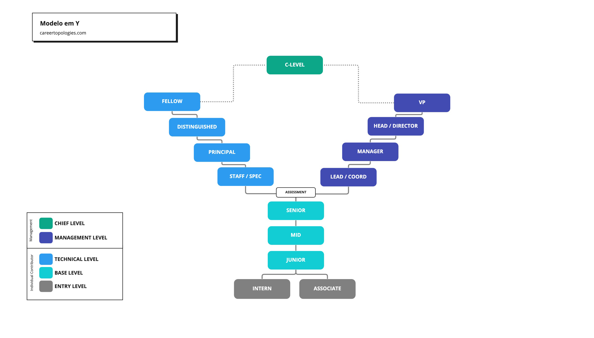
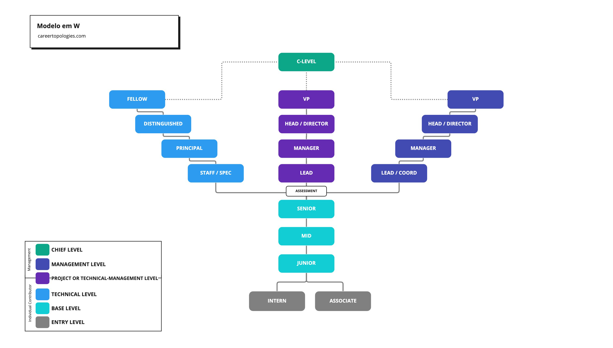

# Topologias

Também conhecido como ladder, escada ou trilha, dentro do framework irei adotar o termo topologia.

Topologias dentro desse contexto podemos entender que é a forma como a carreira é estruturada dentro de uma área.

Não existe uma única forma de construir carreira dentro de uma organização, cada área poderá adotar topologias diferentes, vai depender de cada necessidade.

## Modelo em Y

Modelo dividido em gestão e contribuição individual ou técnico. Onde o profissional deverá escolher em algum momento atuar em gestão ou continuar na jornada técnica individual.

## Modelo em W

Modelo que pode unir dois em Y, onde profissionais técnicos também podem fazer gestão de projetos e/ou equipes. O modelo pode ser interpretado de outra forma para áreas que existe um caminho de consultor ou de programa. A ideia principal é possibilitar um terceiro caminho dentro da empresa.

## Modelo em Rede

Modelo em que a pessoa pode transitar entre funções ou áreas diferentes e seguir onde tenha mais engajamento e performance.

## Futuro

Há várias formas e referências sobre esses modelos, dentro do framework irei assumir alguns padrões e me aprofundar em cada um dos modelos na próxima versão.